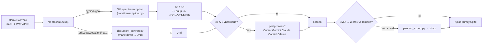

# Архітектура FTW

## Навіщо існує цей документ

Цей документ дає загальну (концептуальну) картину застосунку для людини, яка ще не бачила код: що робить програма, з яких кроків складається обробка одного файлу, і чому GUI влаштовано саме так (один процес, одна задача одночасно, трей/панель, один екземпляр програми). Деталі по конкретних модулях Python — у [INTERNAL-ARCHITECTURE.uk.md](INTERNAL-ARCHITECTURE.uk.md). Формат `settings.json` / `request_queue.json` / `app_log.json` — у [CONFIGURATION.uk.md](CONFIGURATION.uk.md).

## Яку проблему вирішує застосунок

**FTW** (раніше Whisper Fast GUI; GitHub-репозиторій лишається `magnusua/WhisperFastGUI`) — десктопний GUI (Tkinter, один процес, без сервера і без мережевого API) для пакетної транскрибації аудіо/відео в текст на основі Faster-Whisper, а також для конвертації офісних документів у Markdown з опційним AI-постпроцесингом і експортом у Word. Користувач формує чергу файлів, натискає «Старт», і застосунок послідовно обробляє її, показуючи прогрес і лог у тому ж вікні. Зустріч можна записати з мікрофона і системного звуку прямо в ту саму чергу.

Застосунок **повністю безкоштовний** (MIT, [LICENSE](../LICENSE); залежності — [THIRD-PARTY-NOTICES.md](../THIRD-PARTY-NOTICES.md)). Немає акаунта FTW і платних функцій у самій програмі.

Це не бібліотека і не окремий CLI-продукт: увесь контракт — GUI (кнопки, чекбокси, таблиця черги). Єдиний прапорець запуску — `--transcribe` (обробити збережену чергу після старту). Інструкція для користувача — `resources/Help_*.md`.

## Основний потік даних

Дві гілки на вході з файлів (медіа → Whisper, документи → markitdown) плюс **запис зустрічі** (`core/capture.py`: мікрофон ліворуч, WASAPI loopback праворуч → стерео WAV → та сама черга). Опційний AI-постпроцесинг і Word застосовуються однаково до розшифровки й до конвертованого документа. Кожен крок пише лог (`log_store.py` → `app_log.json`) і файли на диск; успішні розмови ще потрапляють в архів (`library.sqlite`). Конфлікти імен — `core/output_conflict.py`.

## Інші джерела тієї самої черги

Черга наповнюється вручну (Drag & Drop, [Додати файли] / [Додати каталог]), з **запису зустрічі** (кнопка / трей / Ctrl+Shift+R; пауза — Ctrl+Shift+P), з **Telegram** і автоматично: `core/queue_manager.py` містить `DirectoryWatcher`, який опитує задані каталоги кожні `WATCH_POLL_INTERVAL_S` (10 с), чекає стабілізації розміру файлу (`WATCH_STABLE_S` ≈ 15 с) і мінімального віку (`WATCH_MIN_AGE_S` = 10 с), після чого додає файл у чергу так само, як ручне додавання. Якщо файл не вдалося декодувати — до `WATCH_MAX_DECODE_RETRIES` (2) повторних спроб. Для решти пайплайна немає різниці, звідки взявся файл — усі ці джерела живлять один потік обробки вище.

**Telegram** (`whisperfast/telegram/`) слухає в тому самому процесі FTW: галочка біля іконки або кнопка у вікні налаштувань. Режим `account` читає особисті чати через Telethon; режим `bot` — через локальний telegram-bot-api. Після обробки в той самий чат повертаються TXT, файли AI, MP3 з відео і відрізок аудіо. Зв’язок «файл → чат» лежить у `.ftw_tg_origin.json` і переписується, коли `source_relocate` переносить джерело. Поки слухач працює, вікно FTW має лишатися відкритим.

## Одна задача одночасно

У будь-який момент виконується лише одна транскрибація/обробка. Це не оптимізація, а свідоме архітектурне обмеження, пов'язане з тим, що модель Whisper — це singleton (`core/model_manager.py: WhisperModelSingleton`), що тримає в пам'яті (і, за наявності GPU, у відеопам'яті) одну завантажену модель одразу. Повторний [Старт] або новий файл зі слідкування під час виконання не запускають другу задачу паралельно — вони стають у чергу. Детальніше про сам singleton і вибір пристрою (AUTO/GPU/CPU) — [MODEL-AND-DEVICE-MANAGEMENT.uk.md](MODEL-AND-DEVICE-MANAGEMENT.uk.md).

При коректному завершенні застосунку модель вивантажується з пам'яті і чиститься кеш CUDA (`WhisperModelSingleton.unload()`); скасування операції ([Скасувати]) зупиняє чергу після завершення поточного сегмента, а не миттєво посеред запису.

## Життєвий цикл GUI: один екземпляр, панель/трей, закриття

- **Один екземпляр.** `whisperfast/single_instance.py` перевіряє PID-лок при старті; повторний запуск пропонує вбити попередній процес, нічого не робити або запустити ще один екземпляр поруч.
- **Панель / Трей / Панель + Трей.** Перемикач режиму відображення визначає, де живе вікно програми (лише панель задач, лише системний трей, або обидва) і що саме робить кнопка закриття (×): у режимі **Трей** × ховає вікно, а не завершує процес — черга та слідкування за каталогом продовжують працювати у фоні; в режимах **Панель** і **Панель + Трей** × показує діалог підтвердження виходу. Це архітектурно важливо: слідкування за каталогом і фонова обробка мають сенс саме тому, що застосунок може жити в треї, не займаючи місця на панелі задач. Повний опис режимів і кнопок — у довідці `resources/Help_UK.md` (це кінцевий, а не архітектурний документ, тому тут не дублюється).
- **Автозапуск.** Опційний, реалізований поза Python-кодом (ярлик `FTW delayed.lnk` у каталозі `shell:startup` із затримкою) — див. [SETUP-AND-DEPENDENCIES.uk.md](SETUP-AND-DEPENDENCIES.uk.md).
- **Запис зустрічі блокує вихід і оновлення.** Поки `CaptureSession.running`, діалог виходу і кнопка [Оновлення] відмовляють: PCM пишеться на диск, убивати процес під час звонку не можна «тихо». Перерваний `captures/capture_*.wav` при наступному старті ремонтується (`repair_wav_header`) і знову ставиться в чергу.

## Взаємодія потоків (threading) і GUI

Обробка черги виконується у фоновому потоці (щоб не блокувати Tkinter mainloop), а будь-яка зміна видимого стану GUI з цього потоку проходить через `app.root.after(0, …)`. Це послідовно застосовано в `core/transcription.py`, `core/output_conflict.py`, `core/source_relocate.py` і `ui/ai_jobs.py` — саме такий контракт очікує кожен виклик `run_queue(app, …)`. `core/` більше не імпортує `tkinter` напряму (`queue_manager.py`, `input_files.py`, `transcription.py` очищені від прямих Tkinter-викликів — діалоги перенесено в `ui/dialogs.py`, підтвердження MP3 іде через callback `app.ask_save_mp3_confirm`); сам механізм очікування відповіді з фонового потоку (`while ...: time.sleep(0.05)` у `output_conflict.py: ask_overwrite_via_tk` і в новому `ask_save_mp3_confirm`) поки не замінено на `threading.Event`.

## Куди дивитися далі

- Модуль-за-модулем, «що де лежить у коді» — [INTERNAL-ARCHITECTURE.uk.md](INTERNAL-ARCHITECTURE.uk.md)
- Формати `settings.json` / `request_queue.json` / `app_log.json` і змінні середовища — [CONFIGURATION.uk.md](CONFIGURATION.uk.md)
- Як влаштовані Cursor/Gemini/Claude/Copilot/Ollama і каталог `promts/` — [POSTPROCESSING-PROVIDERS.uk.md](POSTPROCESSING-PROVIDERS.uk.md)
- Singleton моделі Whisper, вибір пристрою, кеш HF Hub — [MODEL-AND-DEVICE-MANAGEMENT.uk.md](MODEL-AND-DEVICE-MANAGEMENT.uk.md)
- Встановлення, залежності, FFmpeg/Pandoc — [SETUP-AND-DEPENDENCIES.uk.md](SETUP-AND-DEPENDENCIES.uk.md)
- Самооновлення застосунку і моделі — [UPDATES.uk.md](UPDATES.uk.md)
